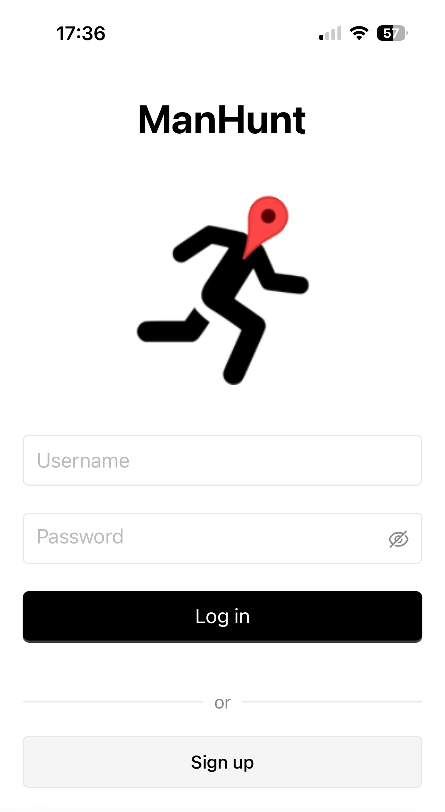
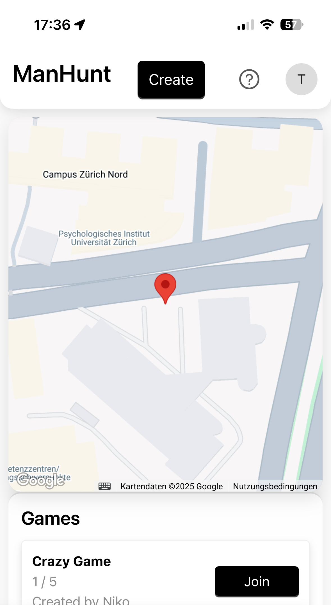
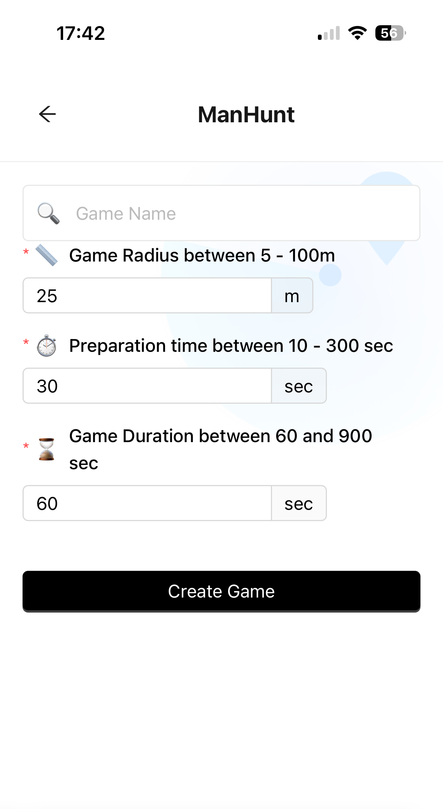
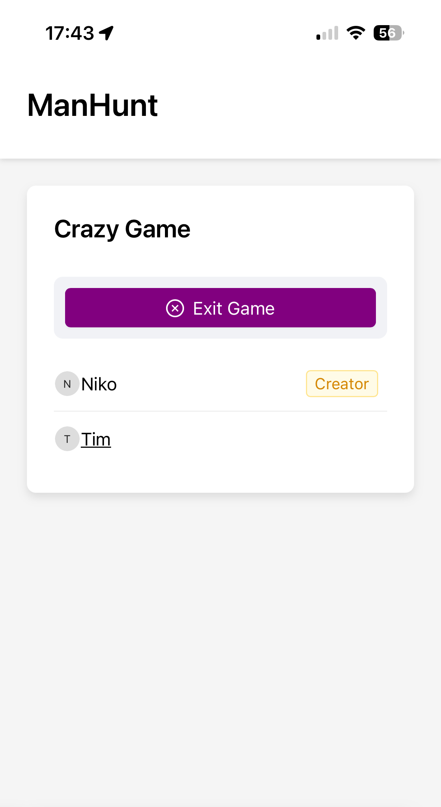
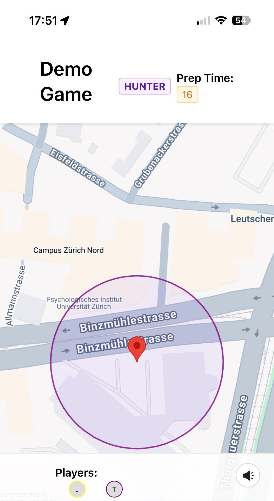
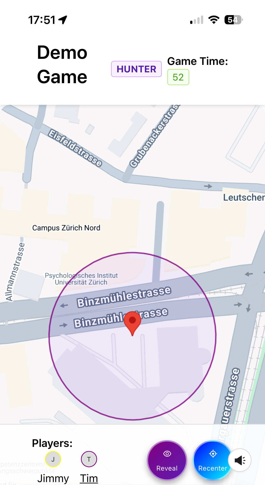
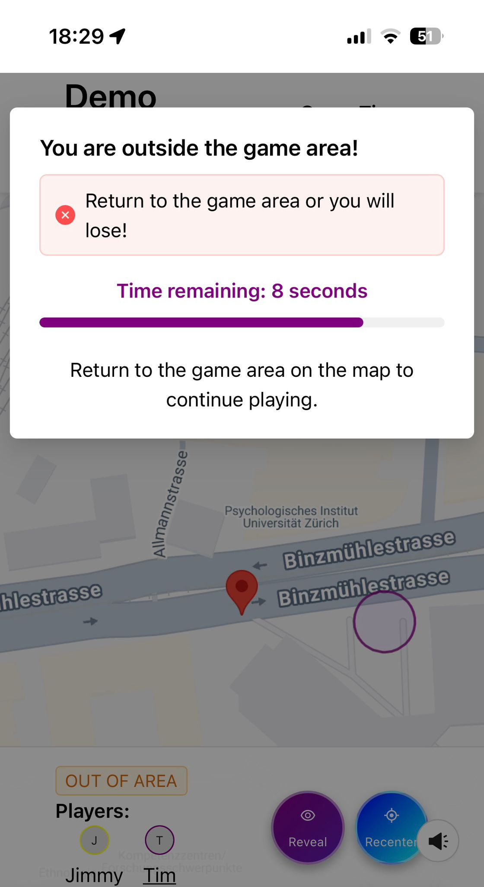
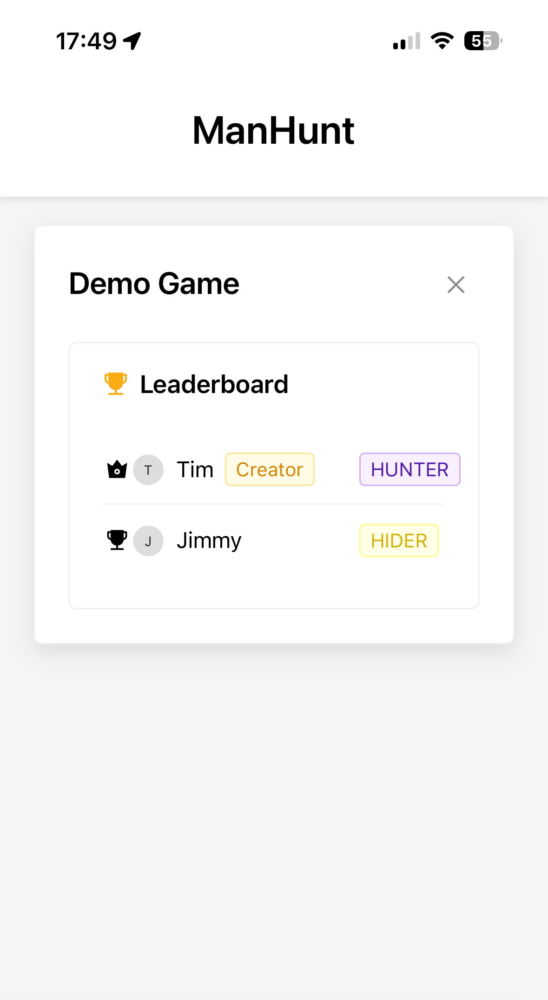
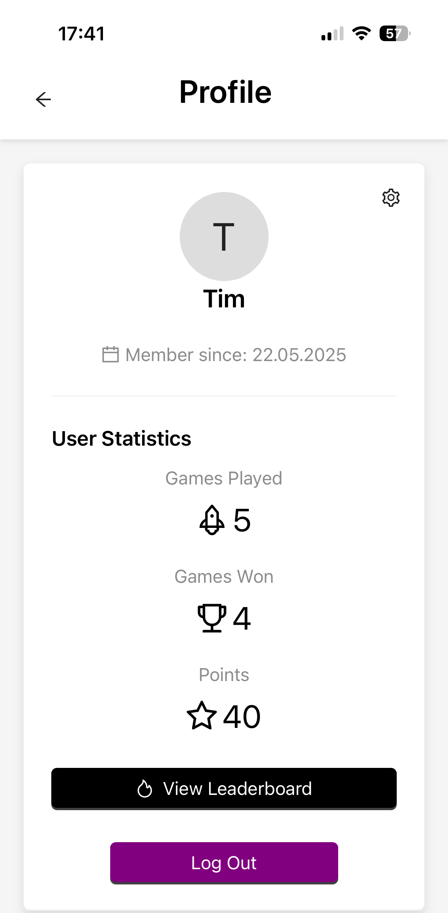
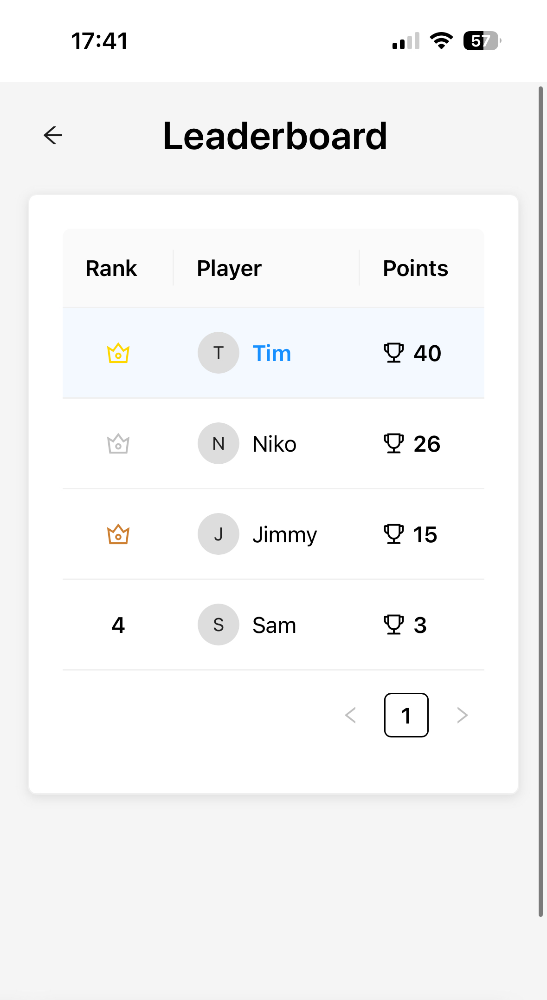

# 🕵️ Welcome to **Manhunt!**


## 🎯 Introduction

**Manhunt** is a mobile, multiplayer web application that reimagines classic hide-and-seek for the smartphone era. By blending real-world movement with battle‐royale–style dynamics, it brings back a nostalgic childhood game in a modern, enhanced form—making playing outside fun again.

Players join or create a game as either **<span style="color:#722ed1">Hunter</span>** or **<span style="color:#fadb14">Hider</span>**, then physically move within a geo-fenced play area that dynamically shrinks. Strategic power-ups—**Reveal** (briefly expose all players) and **Recenter** (shift the game center)—add tactical depth. All clients remain tightly synchronized—sharing GPS positions, player statuses, and a server-anchored countdown—to ensure fairness and eliminate boundary or timing disputes.

**Motivation**
- Rekindle the joy of a nostalgic outdoor game with modern technology
- Solve childhood hide-and-seek frustrations (lost players, boundary disputes, unfair starts)
- Encourage physical activity, social interaction and strategic thinking
- Offer quick, repeatable rounds with clear rules and engaging mechanics

----------

## 🎮 Getting Started

You've already made it to the overview page, well done! Here's a guide to navigating and playing Manhunt:

### 🧭 Navigation

- **Join Games:** Under 'Join games' on the overview page, you'll find a list of currently available games that you can join.
- **Profile:** Click on your profile letter/icon (usually in the top right) to access your game statistics, the global leaderboard, and options to update your password.
- **Create Game:** To start a new game, press the 'create' button on the overview page.

### 🛠️ Creating a New Game

1.  Press the 'create' button.
2.  You can customize the following settings for your new game:
    - **Play-Area:** Define the geographical area where the game will take place.
    - **Preparation Time:** Set the duration (in seconds) that hiders will have to find a hiding spot before the hunt begins.
    - **Game Time:** Set the total duration (in seconds) that the hunter will have to find all the hiders within the play area.
3.  Once you've customized your game, it will be created and listed under the available games for others to join.
4.  The game can be started once a minimum of 2 players have joined the lobby.

### 🚦 Starting the Game

- If you are the game creator (or if the creator presses the button), press the 'start' button in the game lobby to begin the game.

### 🕹️ In the Main Game

- **Player Identification:** In the bottom section of your screen, you will see a list of all active players in the game.
    - <span style="color:red">Red</span> markers or avatars indicate the **Hunter**.
    - <span style="color:green">Green</span> markers or avatars indicate the **Hiders**.
- **Preparation Phase:**
    - The timer at the top right of your screen shows the **preparation timer** counting down.
    - During this time, if you are a **Hider**, use this time to move within the game area (red circle on the map) and find a good hiding spot.
    - You will also see your randomly assigned role (**Hunter** or **Hider**) at the top of the screen.
- **Main Game Phase:**
    - Once the preparation timer reaches zero, the **main game time** will begin, and the timer at the top right will switch to the game countdown.
    - **Your Location:** The marker on the map that follows your movement represents your current location.
    - **Game Area:** The **red circle** displayed on the map indicates the boundaries of the active game area.
    - **Visibility of Other Players:** Initially, you will **not** see the locations of other players on the map.

### 捕 Caught!

- If you are a **Hider** and you are found by the Hunter, you can mark yourself as caught by pressing the '**I have Been Caught!**' button located at the bottom of the screen.
- Once a player is caught, the player count might be updated, and the game area might shrink dynamically (depending on game settings).

### ⚠️ Out of Bounds

- If you move outside the **red circle** game area, you will receive a warning message.
- You will have a **10-second timeframe** to move back into the game area. If you remain outside the boundaries for longer than 10 seconds, you will be eliminated from the game.

### ✨ Power-Ups!

- **All Players:** Every player (both Hunter and Hiders) has a one-time use power-up that allows them to see the locations of all other active players on the map for **10 seconds**. This can be activated by pressing the '**Reveal**' button. Use this strategically, as it can only be used once per game!
- **Hunter:** The Hunter has an additional unique power-up. By pressing the '**Recenter**' button, the Hunter can dynamically change the center of the game area to their current location. This power-up can also typically be used only once.

### 🏁 Game End

- The game will end when **all Hiders have been caught** by the Hunter, or when the **main game timer reaches zero**.
- Once the game ends, you will be automatically redirected to the **leaderboard** page, where you can see the results of the game.

### Have fun and enjoy playing Manhunt!

----------

## 🛠️ Troubleshooting

- **Location Issues:** If you experience problems with your location not updating correctly, try the following:
    - **Reload the page:** This can often resolve temporary issues with location services.
    - **Navigate to the overview page and back:** This can sometimes re-initialize the location tracking.
- **Game Lobby Issues:** If you encounter problems within a game lobby (e.g., not being able to join or start), try:
    - **Exiting the existing game:** Leave the current lobby you are in and try joining or creating a new game.

----------

## ⚙️ Technologies Used
- **Framework:** Next.js & React (TypeScript)
- **UI Library:** Ant Design
- **Styling:** CSS Modules
- **Animations:** Framer Motion
- **APIs:** Google Maps JavaScript API
- **Testing & Quality:** SonarQube
- **Deployment:** Vercel
----------

## 🧩 High-Level Components

1. **Pages**
    - **Role:** Serve as the main entry points for each URL route, defining layout and page logic.
    - **Correlations:**
        - Import and render UI **Components** for page-specific views.
        - Use **Hooks** to obtain data and manage states.
        - Call **API Service** methods to retrieve and update backend data.
    - **Main File:**
    [games/[gameId]/[playerId]/page](app/games/[gameId]/[playerId]/page.tsx)

2. **Components**
    - **Role:** Encapsulate shared UI elements for map integration, including the provider and the map renderer.
    - **Correlations:**
        - Imported by **Pages** to display the game map.
        - **GoogleMapsProvider** uses a 'useEffect' hook to fetch and initialize the Google Maps API key on mount.
        - **MapComponent** consumes the provider's context to render the map, player markers and game area circle.
        - Styles are applied via CSS modules in the **Styles**.
    - **Main File:**
    [GoogleMapsProvider](app/components/GoogleMapsProvider.tsx)

3. **API Service**
    - **Role:** Centralize all HTTP communication with the backend REST API.
    - **Correlations:**
        - Invoked by **Pages** and **Hooks** to fetch or mutate game and user data.
        - Returns JSON payloads that are passed into **Components** for rendering.
    - **Main File:**
    [apiService](app/api/apiService.ts)


4. **Hooks**

Custom React hooks used to encapsulate shared logic like geolocation, audio playback, and polling.

- **Role:** Provide reusable logic for stateful or side-effect-heavy operations.
- **Used In:** Pages and components.
- **Depends On:** API Service for data fetching where needed.
- **Main Files:**
  - [`useGoogleMaps`](app/hooks/useGoogleMaps.ts)

---

 4.1 **`useAudio` Hook**

- **Purpose:** Manage audio playback in React components.
- **Inputs:** `src` (audio file path), optional volume.
- **Returns:** `play` function to trigger audio.

**Features:**
- Initializes and references an `HTMLAudioElement` using `useRef`.
- Handles cleanup on unmount to prevent memory leaks.
- Resets and plays audio on demand, with error handling.

**Usage Example:**
```tsx
const play = useAudio("/sounds/button.mp3", 0.3);
// Call `playClick()` on e.g. button click
```


5. **Styles**
    - **Role:** Define the visual theming and layout using scoped CSS Modules.
    - **Correlations:**
        - Imported by **Pages** and **Components** to ensure consistent styling across the app.
    - **Main File:**
    [game-play](app/styles/game-play.css)
----------

## 🚀 Launch & Deployment

Prerequisites
- Node.js 18+
- npm 9+
- **Browser Location:** Ensure that your browser has location services enabled; otherwise, the game functions will not work.

Clone the Repository
```bash
git clone git@github.com:kiransain/sopra-fs25-group-26-client.git
cd sopra-fs25-group-26-client
```
# Install Dependencies
```bash
npm install
```
# Local Development

```bash
npm run dev
```

# Production Build

```bash
npm run build
npm start
```

## ⚙️ External Dependencies

The application relies on the following external dependencies:

- **Backend Server:** A running backend server is required for the application to function correctly. Ensure that the backend is accessible at `localhost:8080`. If your backend is running on a different address, you will need to update the API URL in the `.env` file.

- **Google Maps API Key:** The Google Maps JavaScript API is used for displaying maps and handling location services within the game. You need to obtain a Google Maps API key and set it as the value of the `NEXT_PUBLIC_GOOGLE_MAPS_API_KEY` environment variable in your `.env` file.

## 🚀 Deployment

The frontend application is configured for automatic deployment to Vercel. This process is triggered automatically whenever changes are pushed to the `main` branch of the Git repository.

## 📦 Releases

The following steps outline the release process for the frontend application:

1.  **Develop Branch:** Ensure that all new features, bug fixes, and changes are committed to the `dev` branch.
2.  **Pull Request:** Create a pull request to merge the `dev` branch into the `main` branch.
3.  **Code Review:** The pull request will undergo a code review process. Ensure that all feedback is addressed and the changes are approved.
4.  **Merge:** Once the pull request is approved, merge the `dev` branch into the `main` branch.
5.  **Tagging:** After the merge, create a new tag for the release version (e.g., `M%`) and push this tag to the remote repository.
6.  **Vercel Deployment:** Vercel will automatically detect the new tag on the `main` branch and initiate a production deployment of the latest version of the application.

## 🖼️ Illustrations

### Main User Flows:

1.  **Login/Register Page** - The main entry point where users can log in to their existing accounts or register for a new one to access the Manhunt application.

    

2. **Overview Page** – The hub, where users can see all active game lobbies, join them or create a new one. Additionally, users can view their profile and global rankings by clicking on the profile icon in the top right corner or read about the rules in the information section.

   

3. **Create Game** – The creator sets the game parameters. After successfully creating a game, the user is redirected to the game lobby.

   

4. **Game Lobby** – All players gather here before the game starts. The creator can start the game, and all players can leave the lobby.

   

5. **Main Game in Preparation** – The game is in preparation mode. Players can see their updated realtime location on the map, their roles and the game area. The main game starts when the countdown reaches zero.

   

6. **Main Game in Progress** – The game is in progress. Players can additionally see their role-specific power ups. Hiders also have a 'caught' button to admit they are caught. Players outside of the game area have 10 seconds to return into the game area otherwise they are out. The game ends when the countdown reaches zero, all hiders were caught or the hunter it out due the out-of-area penalty.

   

7. **Out of Area** - Once a player it out of area, they have 10 seconds to return into the game area - otherwise they are eliminated from the game!

   

8. **Game End** – The game ends after either the time is up or all players have been caught. Players can see the results and their roles. Players are awarded with points based on their performance and can return to the overview page.

    

9. **Profile Page** – The profile page shows the player's statistics, including the number of games played, won and lost and their points. From here users can access the global leaderboard, update their password or log out.

   

10. **Global Leaderboard** – The global leaderboard shows all users ranked based on their points. Players can see their rank and the rank of other players.

    

## 🛣️ Roadmap
Future contributors might consider:
- Customizable role assignment logic (e.g. several hunters)
- Adding support for team-based gameplay
- Limit available games to user’s current city (e.g., Zurich only)

## 👥 Authors & Acknowledgments

- Kiran Nanduri - frontend - [](https://github.com/kiransain)

- Ermin Mumic - backend - [](https://github.com/ermin-mumic)

- Gent Jashari - frontend - [](https://github.com/GentJash)

- And many thanks to our TA Ambros Eberhard, the SoPra teaching team, the course in parallel Software Engineering by Prof. Thomas Fritz, and the open-source tools we relied on.

- This code is based on the [SoPra-FS25-Client](https://github.com/HASEL-UZH/sopra-fs25-template-client)
----------

## 📄 License

This project is licensed under the [MIT License](LICENSE).

----------

## 🎵 Audio Credits

The background music and sound effects used in this game are copyright-free.  
They are sourced from [Pixabay](https://pixabay.com/), a platform offering royalty-free media.

